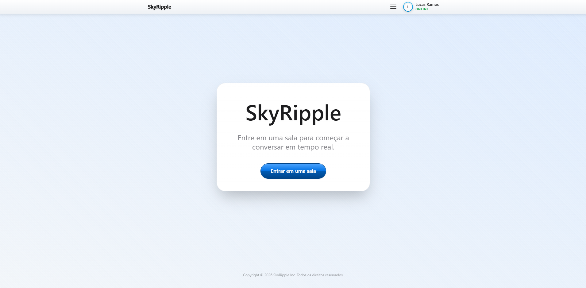
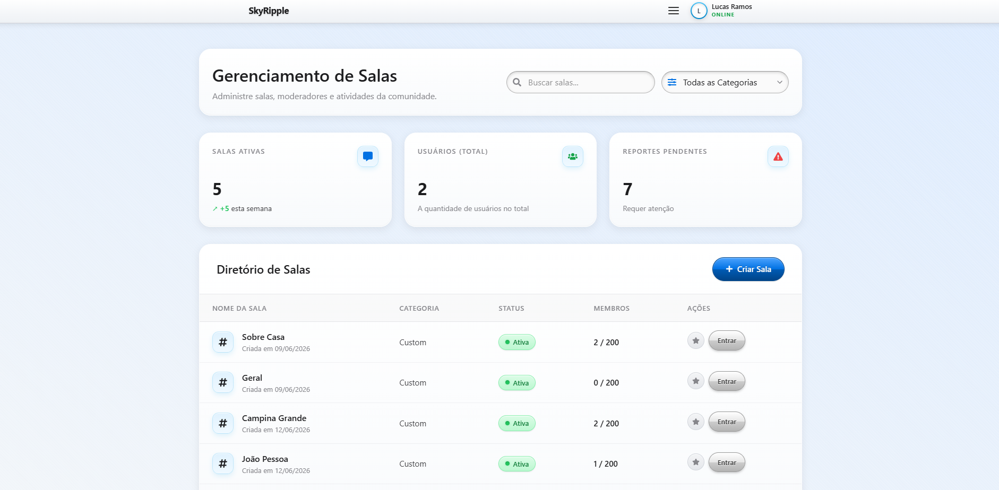
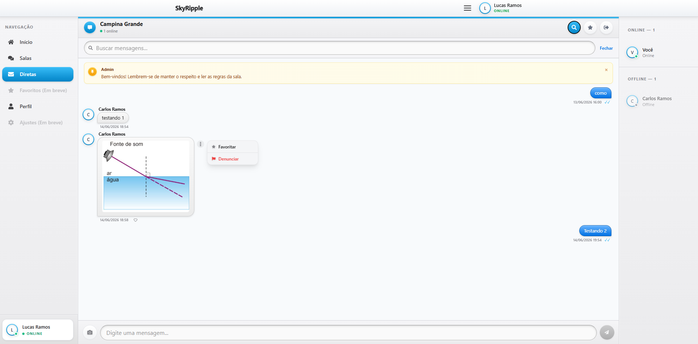
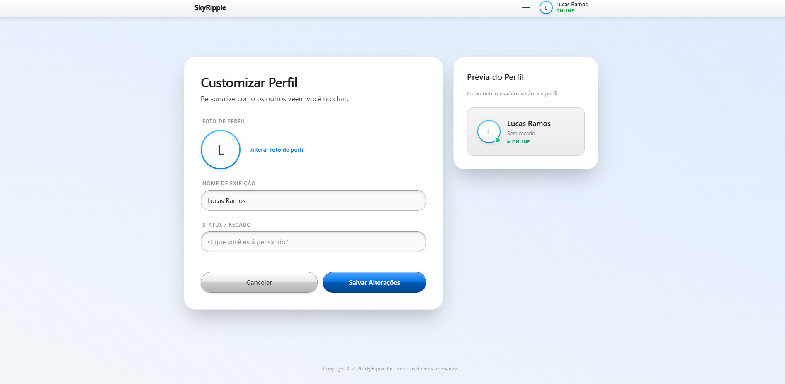

# SkyRipple


O SkyRipple é uma aplicação web de chat em tempo real onde os usuários podem se conectar, entrar em salas temáticas e trocar mensagens instantaneamente. O projeto foca em uma experiência rica e nostálgica, trazendo uma estética clean com identidade visual inspirada no Web 2.0 Gloss (Skeuomorfismo e com influências do Frutiger Aero) aliada a tecnologias web modernas.

## O que o projeto faz

O SkyRipple funciona como um ponto de encontro virtual. De forma simples, ele permite:

* Criar uma conta e fazer login;
* Visualizar e favoritar diferentes salas de conversa;
* Entrar em salas e conversar em tempo real com outras pessoas;
* Personalizar o seu perfil (nome e recado/status);
* Usar o sistema de busca interna do chat para encontrar mensagens;
* Navegar de forma confortável tanto no Modo Claro quanto no Modo Escuro (com o visual dos botões e painéis se adaptando).

## Qual problema ele resolve

Este projeto foi construído como um projeto prático para a disciplina de Programação Web II. Ele resolve o problema básico de comunicação em tempo real em grupos, servindo como um excelente laboratório para conectar conceitos avançados de desenvolvimento, tais como:

* Criação de interfaces ricas e responsivas no frontend;
* Construção de uma API robusta no backend;
* Autenticação e segurança com JWT e criptografia de senhas;
* Comunicação bidirecional em tempo real usando WebSockets;
* Arquitetura visual híbrida, combinando a agilidade do Tailwind CSS com o controle detalhado do CSS para criar efeitos visuais.

## Tecnologias usadas

### Frontend

* React 19
* Vite
* Tailwind CSS 4
* CSS Híbrido (para efeitos com muitos detalhes, brilhos e profundidade)
* React Router DOM
* React Icons
* Socket.IO Client

### Backend

* Node.js
* Express
* Socket.IO
* Supabase (banco de dados em nuvem)
* Bibliotecas de segurança e utilidades (bcryptjs, jsonwebtoken, cors, dotenv, helmet e express-rate-limit)
* Arquitetura de banco de dados centralizada no Node.js (Supabase RLS Desativado)

### Ferramentas

* Git / GitHub
* Render (deploy do Backend)
* Vercel (Deploy do Frontend)
* npm

## Como rodar localmente

Para testar o projeto no seu computador, primeiro clone o repositório e entre na pasta:

```bash
git clone https://github.com/LucasRamosSilva-15/WebChat.git
cd WebChat
```

*(Nota: substitua a URL acima caso o repositório esteja em outro endereço no GitHub).*

### Frontend

Em um terminal, entre na pasta do frontend, instale as dependências e inicie o servidor de desenvolvimento:

```bash
cd frontend
npm install
npm run dev
```

Você também precisará criar um arquivo `.env` na raiz da pasta `frontend`:

```env
VITE_BACKEND_URL=http://localhost:3001
VITE_API_URL=http://localhost:3001/api
```

### Backend

Em outro terminal, entre na pasta do backend, instale as dependências e inicie o servidor:

```bash
cd backend
npm install
npm run dev
```

Crie um arquivo `.env` na raiz da pasta `backend` com as variáveis necessárias (ajuste as chaves do Supabase e o JWT_SECRET conforme o seu ambiente):

```env
PORT=3001
JWT_SECRET=sua_chave_secreta_aqui
USE_MOCK_DB=false
SUPABASE_URL=sua_url_do_supabase
SUPABASE_ANON_KEY=sua_chave_anonima_do_supabase
FRONTEND_URL=http://localhost:5173
```

## Link do deploy

* **Frontend:** [https://web-chat-project-web2.vercel.app](https://skyripple-project-web2.vercel.app/)
* **Backend/API:** [https://webchat-9vqr.onrender.com](https://webchat-9vqr.onrender.com)

## Imagens / Screenshots






## Funcionalidades

* [x] Página inicial (Home)
* [x] Login e Cadastro de contas
* [x] Listagem e favoritação de salas
* [x] Chat em tempo real (envio e recebimento de mensagens)
* [x] Busca avançada dentro do chat
* [x] Customização de perfil do usuário (nome de exibição e recado)
* [x] Temas visuais: Modo Claro e Modo Escuro
* [x] Layout responsivo e menus modais
* [x] Envio de imagens e armazenamento em nuvem (Storage)
* [ ] Refinamentos na persistência e histórico longo de mensagens
* [ ] Testes automatizados
* [ ] Documentação
* [ ] Sistema de criptografia de email, senhas, mensagens e etc
* [ ] Otimizações no frontend, backend e banco de dados
* [ ] Aumentar a segurança do sistema e do banco de dados
* [ ] Página de Feedback (só falta a parte do backend)
* [x] Administração do sistema (painel de controle) (só falta a parte do backend)
* [ ] Sistema de administração das salas (moderação avançada, cargos, etc) (A página está pronta, só falta o backend)
* [x] Página de suporte (só falta a parte do backend)
* [ ] Adaptação para telas menores (como notebooks e celulares e etc)

## Estrutura do projeto

```txt
.
├── backend/
│   ├── src/
│   │   ├── middleware/
│   │   │   └── auth.js
│   │   └── routes/
│   │       └── api.js
│   ├── server.js
│   ├── package.json
│   └── .env
├── docs/
├── frontend/
│   ├── src/
│   │   ├── assets/
│   │   ├── components/
│   │   ├── pages/
│   │   │   ├── Chat.jsx
│   │   │   ├── Home.jsx
│   │   │   ├── Login.jsx
│   │   │   ├── Rooms.jsx
│   │   │   └── ...
│   │   ├── services/
│   │   |   ├── api.js
│   │   ├── styles/
│   │   │   ├── chat.css
│   │   │   ├── skeuo.css
│   │   │   └── ...
│   │   ├── App.jsx
│   │   ├── socket.js
│   │   ├── webchat-components.css
│   │   └── index.css
│   ├── package.json
│   └── .env
└── README.md
```

## Status atual

O projeto **SkyRipple** encontra-se em desenvolvimento ativo.
O frontend já está bastante avançado, com a maioria das páginas construídas, responsividade implementada e a identidade visual skeuomórfica bem estruturada em modo claro e escuro. A estrutura base de WebSockets e comunicação em tempo real já ocorre com o backend.
Ainda existem funcionalidades que estão sendo aprimoradas, como detalhes finais de moderação nas salas e otimizações gerais do Frontend, Backend, Banco de Dados, criação de novas páginas, testes automatizados e segurança.

## link da documentação SWAGGER

<https://webchat-9vqr.onrender.com/api-docs/>

## Próximos passos

* Finalizar e polir a integração total entre o backend, frontend e Supabase.
* Melhorar a persistência, paginação e carregamento otimizado de mensagens antigas.
* Refinamentos, melhorias e mudanças (não extremas) na identidade visual e layout.
* Otimizar o Frontend, Backend e o Banco de dados.
* Criar um sistema de administração do site (página do administrador com um panel de controle) e das salas
* Criar novas páginas (como o Admin.jsx e Feedback.jsx)
* Refinar a validação de dados em rotas do backend.
* Adicionar testes automatizados
* Capturar as telas finais e adicionar screenshots no README.

## Autor

Desenvolvido por **Lucas Ramos Silva, Wssihélio Vasconcelos, Ruan Victor e Gabriel Lobão.** como parte da disciplina de Programação Web II.
